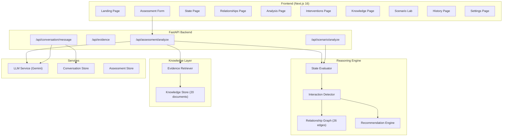

# Darukaa Biosphere

**AI-Powered Biodiversity Intelligence and Environmental Decision System**

[](https://www.python.org/)
[](https://nextjs.org/)
[](https://fastapi.tiangolo.com/)
[](#automated-tests)
[](LICENSE)

---

## The Problem

Environmental decision-making is fragmented. Soil scientists, climate researchers, ecologists, and land managers each work within their own domain, using separate tools and separate data. When a landscape degrades, the causes are rarely singular -- they involve reinforcing feedback loops across soil health, water availability, biodiversity, and land use that no single-variable analysis can capture.

Existing tools either reduce complexity to a single metric or delegate reasoning entirely to a large language model, producing fluent text without verifiable scientific grounding.

## The Solution

Darukaa Biosphere is a deterministic environmental intelligence system that analyses ecosystems across five dimensions simultaneously. It identifies multi-variable ecological interactions, retrieves supporting scientific evidence, and produces traceable, evidence-backed intervention plans.

The system follows a four-stage analytical pipeline:

```
Observe  -->  Understand  -->  Reason  -->  Act
```

| Stage | What it does | Implementation |
|-------|-------------|----------------|
| **Observe** | Collect environmental variables across soil, climate, land, biodiversity, and human impact | Assessment input form, variable extraction from natural language |
| **Understand** | Classify each variable against documented ecological thresholds | State evaluator with FAO/IPCC-sourced threshold tables |
| **Reason** | Identify multi-variable interactions using a deterministic causal graph | Relationship graph with 26 encoded ecological pathways |
| **Act** | Generate prioritised, evidence-backed interventions | Recommendation engine linking interactions to specific actions |

## Why This Is Not a Chatbot

Most AI environmental tools pass user input directly to a large language model and return its output. Darukaa Biosphere does not work this way.

The reasoning core is a **deterministic ecological relationship graph** -- a hardcoded directed acyclic graph encoding 26 scientifically established causal relationships between environmental variables. The system identifies which pathways are activated by the observed environmental state, traces causal chains through the graph, and retrieves supporting evidence from a curated knowledge repository.

An LLM (Gemini) is used only for natural language formatting of results and conversational interaction. If the LLM is unavailable, the system falls back to template-based responses. **The reasoning, evidence retrieval, and recommendations are never LLM-generated.**

---

## Architecture



---

## Multi-Variable Ecological Reasoning

### How it works

The system does not analyse variables in isolation. It identifies **interaction patterns** -- combinations of stressed variables that produce compounding ecological effects.

### Concrete example

Given the following input for a semi-arid agricultural site in Maharashtra:

| Variable | Value | Classification |
|----------|-------|---------------|
| Soil organic carbon | 0.30% | Critical |
| Soil moisture | Low | Poor |
| Annual rainfall | 680 mm | Poor |
| Temperature | 31.4 C | Moderate |
| Land use | Agriculture (wheat monoculture) | Poor |
| Habitat diversity | Low | Poor |
| Fragmentation | High | Poor |
| Species richness | Low | Poor |
| Pollinator presence | Limited | Poor |
| Native vegetation | 12% | Critical |

The system identifies the following interactions:

**1. Water-Soil Carbon Feedback**
- Variables: Rainfall, Soil moisture, Organic carbon
- Mechanism: Low rainfall limits soil moisture, reducing microbial activity and organic matter decomposition. This decreases soil organic carbon accumulation, which in turn reduces water retention capacity, creating a reinforcing degradation cycle.
- Supporting evidence: EVD-001, EVD-007, EVD-014, EVD-020

**2. Monoculture-Habitat Simplification**
- Variables: Monoculture, Habitat diversity, Pollinator resources
- Mechanism: Continuous monoculture eliminates habitat heterogeneity, reducing structural diversity needed by pollinating species.
- Supporting evidence: EVD-003, EVD-005, EVD-015

**3. Fragmentation-Biodiversity Cascade**
- Variables: Habitat fragmentation, Species richness, Ecosystem resilience
- Mechanism: High fragmentation isolates remaining habitat patches, reducing gene flow and species dispersal capacity.
- Supporting evidence: EVD-006, EVD-008

Each interaction requires a minimum of three co-occurring stressed variables. The system does not fabricate multi-variable conclusions from single-variable input.

---

## Knowledge and Evidence Layer

### Repository

The knowledge store contains **20 curated scientific documents** drawn from:

| Source | Documents | Category |
|--------|-----------|----------|
| FAO / ITPS | 4 | Soil, Land, Climate |
| IPCC | 1 | Climate |
| IPBES | 2 | Biodiversity, Land |
| Peer-reviewed journals | 13 | Soil, Biodiversity, Land, Climate, Human Impact |

Journals include: *Science*, *Nature Communications*, *PNAS*, *Science Advances*, *Nature Ecology and Evolution*, *Ecological Indicators*, *Agriculture Ecosystems and Environment*, *Journal of Applied Ecology*, *Ecohydrology*, *Agronomy Journal*, *Environment International*, *Annual Review of Ecology Evolution and Systematics*.

Each document contains:
- Metadata: title, authors, year, source, evidence type
- Environmental variables it addresses
- Text chunks for evidence retrieval

### Retrieval flow

1. **Variable extraction** -- identify active environmental variables from the assessment input
2. **Keyword extraction** -- derive contextual search terms from ecosystem type and stressed conditions
3. **Filtered search** -- query the knowledge store by variable overlap and keyword relevance
4. **Relevance scoring** -- score each document 0-100 based on variable overlap, alias matching, and keyword density
5. **Ranked return** -- return the top-N most relevant documents

### Evidence traceability

Every reasoning output is linked to specific evidence document IDs. The frontend displays these IDs alongside each interaction and recommendation. Users can navigate to the Knowledge page to inspect the full source, year, and abstract for any cited document.

The traceability chain is:

```
Observation --> Interaction (with evidence IDs) --> Recommendation (with evidence IDs) --> Knowledge page (full source)
```

---

## Environmental Variables and Relationship Graph

### Variables tracked

| Dimension | Variables |
|-----------|-----------|
| **Soil** | Organic carbon (%), pH, moisture, nitrogen (kg/ha), phosphorus (kg/ha) |
| **Climate** | Rainfall (mm/yr), temperature (C), seasonality, drought risk (derived) |
| **Land** | Land use type, crop, habitat diversity, fragmentation |
| **Biodiversity** | Species richness, pollinator presence, native vegetation (%), ecological connectivity (derived) |
| **Human Impact** | Pollution level, deforestation level |

### Relationship graph

The ecological relationship graph encodes **26 directed relationships** between environmental variables. Each relationship specifies:

- Source and target variable
- Direction (positive or negative correlation)
- Strength (strong, moderate, weak)
- Causal mechanism (plain-language description)
- Supporting evidence IDs

Example pathways:

```
rainfall --[drives]--> water_availability --[determines]--> soil_moisture
soil_moisture --[regulates]--> soil_biology --[builds]--> soil_organic_carbon
soil_organic_carbon --[enhances]--> soil_moisture  (feedback loop)

monoculture --[reduces]--> habitat_diversity --[supports]--> species_richness
fragmentation --[disrupts]--> habitat_connectivity --[enables]--> species_richness
```

The graph supports **causal path tracing** -- given a start and end variable, the system can enumerate all causal chains connecting them, along with the evidence IDs supporting each link.

---

## Recommendation Engine

Recommendations are generated from **7 intervention templates**, each activated by specific interaction patterns. Each recommendation includes:

| Field | Description |
|-------|-------------|
| `title` | Specific, actionable intervention |
| `why` | Scientific rationale linking the intervention to detected interactions |
| `impacts` | Expected effects on specific metrics (direction and magnitude) |
| `timeHorizon` | Short (0-6 months), medium (6-24 months), or long (2-5 years) |
| `evidenceStrength` | Strong, moderate, or limited -- based on the quality of supporting evidence |
| `supportingEvidence` | List of evidence document IDs |
| `priority` | Ranked by relevance to detected interactions |

Recommendations are **never generated by the LLM**. They are deterministic outputs of the interaction detection pipeline.

---

## Conversational Memory and Clarification Flow

The conversation service maintains multi-turn session state. Each session tracks:

- Accumulated environmental variables across all messages
- Missing critical variables
- Conversation history

When a user describes their environment in natural language, the system:

1. Extracts environmental variables from the text (regex and keyword matching)
2. Merges new variables into the existing session context
3. Identifies which critical variables are still missing
4. Generates a targeted follow-up question for the most important missing variable
5. Provides multiple-choice options where appropriate

The system **never re-asks for information already provided** in the current session.

---

## Scenario Lab

The Scenario Lab allows users to modify environmental parameters and observe projected ecological outcomes. It uses the **same reasoning engine** as the primary assessment -- not a separate model.

The interface clearly distinguishes:
- **Observed values** -- from the original assessment
- **Simulated values** -- modified by the user via parameter sliders

Adjustable parameters include rainfall, soil carbon, temperature, habitat diversity, and land use intensity. Results are shown as side-by-side comparisons of composite environmental scores.

---

## Frontend Pages

The frontend is a 10-page environmental intelligence interface.

| Page | Route | Purpose |
|------|-------|---------|
| Landing | `/` | Project introduction with interactive SVG relationship diagram |
| Assessment | `/assessment` | Environmental data input form with pre-filled demo values |
| Environmental State | `/state` | Classified metrics across soil, climate, land, biodiversity |
| Ecological Relationships | `/relationships` | Interactive SVG causal graph with node selection and detail panels |
| Environmental Analysis | `/analysis` | Multi-variable reasoning chain: observations, interactions, implications |
| Intervention Plan | `/interventions` | Prioritised evidence-backed recommendations |
| Knowledge | `/knowledge` | Retrieved scientific evidence with filtering by category |
| Scenario Lab | `/scenarios` | Parameter modification and projected outcome comparison |
| Assessment History | `/history` | List of previous assessments |
| Settings | `/settings` | Display preferences |

All pages use live API data when the backend is running. When the backend is unavailable, they fall back to structured mock data that mirrors the API response format exactly.

---

## API Endpoints

### `POST /api/assessment/analyze`

Full environmental assessment pipeline.

```json
{
  "soil": { "organic_carbon": 0.3, "ph": 6.2, "moisture": "low" },
  "climate": { "rainfall": 680, "temperature": 31.4, "seasonality": "high" },
  "land": { "land_use": "agriculture", "crop": "Wheat", "habitat_diversity": "low", "fragmentation": "high" },
  "biodiversity": { "species_richness": "low", "pollinator_presence": "limited", "native_vegetation": 12 }
}
```

Returns: `environmental_state`, `relationships` (graph nodes/edges), `reasoning` (observations, interactions, implications, evidence IDs), `recommendations`, `evidence`, `missing_information`, `scientist` (conversational message).

### `GET /api/evidence`

List and filter scientific evidence. Query parameters: `category`, `topic`, `variable`, `evidence_type`.

### `POST /api/conversation/message`

Multi-turn conversational interaction with context memory.

```json
{
  "conversation_id": "CONV-A1B2C3D4",
  "message": "The soil has about 0.3% organic carbon and rainfall is around 680mm"
}
```

Returns: extracted variables, response message, follow-up question, remaining missing variables.

### `POST /api/scenario/analyze`

Scenario comparison using the same reasoning engine.

```json
{
  "assessment_id": "ASM-A1B2C3",
  "parameters": { "rainfall": 120, "soil-carbon": 0.8 }
}
```

### `GET /api/assessments`

List all saved assessments.

### `GET /api/assessments/{id}`

Retrieve a specific assessment result.

### `GET /health`

Health check returning knowledge document count and LLM availability.

---

## Technology Stack

### Frontend

| Technology | Version | Purpose |
|-----------|---------|---------|
| Next.js | 16.3.5 | React framework with App Router |
| React | 19.2.8 | UI library |
| TypeScript | 5.x | Type safety |
| Tailwind CSS | 4.x | Utility-first styling |
| Recharts | 3.10.1 | Data visualisation (Scenario Lab) |
| Lucide React | 1.47.0 | Icon system |

### Backend

| Technology | Version | Purpose |
|-----------|---------|---------|
| Python | 3.12+ | Runtime |
| FastAPI | 0.115.0 | API framework |
| Pydantic | 2.9.0 | Data validation and serialisation |
| Uvicorn | 0.30.0 | ASGI server |
| google-generativeai | 0.8.0 | Gemini LLM integration |
| pytest | 8.3.0 | Testing framework |

---

## Repository Structure

```
darukaa/
  src/
    app/
      page.tsx                          # Landing page
      globals.css                       # Design system tokens
      (dashboard)/
        layout.tsx                      # Dashboard shell with AssessmentProvider
        assessment/page.tsx             # Environmental data input
        state/page.tsx                  # Classified metrics
        relationships/page.tsx          # Interactive causal graph
        analysis/page.tsx               # Reasoning chain
        interventions/page.tsx          # Recommendations
        knowledge/page.tsx              # Evidence repository
        scenarios/page.tsx              # Scenario Lab
        history/page.tsx                # Assessment history
        settings/page.tsx               # Display preferences
    components/
      layout/                           # AppShell, Sidebar, TopBar
      ui/                               # Metric, StatusIndicator, SectionHeader, LoadingState
    context/
      AssessmentContext.tsx              # React context for API state
    data/
      mock-*.ts                         # 8 mock data files (fallback)
    lib/
      api.ts                            # Centralised API client
  backend/
    app/
      main.py                           # FastAPI application entry
      config.py                         # Settings from environment
      models/
        environmental.py                # Input schemas (AssessmentRequest, etc.)
        responses.py                    # Output schemas matching frontend types
      reasoning/
        relationship_graph.py           # 26-edge deterministic causal graph
        state_evaluator.py              # Threshold-based metric classification
        interaction_detector.py         # Multi-variable interaction detection
        recommender.py                  # Evidence-backed recommendation generation
      rag/
        knowledge_store.py              # In-memory document store
        retriever.py                    # Variable-based evidence retrieval
      routes/
        assessment.py                   # POST /api/assessment/analyze
        evidence.py                     # GET /api/evidence
        conversation.py                 # POST /api/conversation/message
        scenario.py                     # POST /api/scenario/analyze
      services/
        llm_service.py                  # Gemini integration with template fallback
        conversation_service.py         # Multi-turn session management
        assessment_store.py             # In-memory assessment persistence
    data/
      knowledge_base.json               # 20 curated scientific documents
    tests/
      test_reasoning.py                 # 17 automated tests
    .env.example                        # Environment variable template
    requirements.txt                    # Python dependencies
  package.json
  .gitignore
```

---

## Local Setup

### Prerequisites

- Node.js 18+
- Python 3.12+
- A Gemini API key (optional -- the system works without it using template fallback)

### Frontend

```bash
npm install
npm run dev
# Runs on http://localhost:3000
```

### Backend

```bash
cd backend
cp .env.example .env
# Add your LLM_API_KEY to .env (optional)

pip install -r requirements.txt

cd ..
python -m uvicorn backend.app.main:app --host 0.0.0.0 --port 8000 --reload
# Runs on http://localhost:8000
# API docs at http://localhost:8000/docs
```

### Environment Variables

| Variable | Required | Default | Description |
|----------|----------|---------|-------------|
| `LLM_API_KEY` | No | (empty) | Gemini API key for natural language generation |
| `LLM_MODEL` | No | `gemini-2.0-flash` | Gemini model identifier |
| `FRONTEND_URL` | No | `http://localhost:3000` | CORS origin for the frontend |
| `DATABASE_URL` | No | `sqlite:///./darukaa.db` | Database URL (reserved for future use) |

The `.env` file is excluded from version control via `.gitignore`. No API keys or secrets are committed to the repository.

---

## LLM Integration and Fallback

The LLM (Google Gemini) is used for two purposes:

1. **Scientist message** -- generating a natural-language summary of the assessment findings on the Analysis page
2. **Conversation responses** -- producing contextual responses in the conversational interface

If the LLM API key is not configured, or if the API call fails, the system falls back to **template-based responses** that use the same structured reasoning data. The quality of environmental analysis, interaction detection, evidence retrieval, and recommendations is **identical** with or without the LLM.

The LLM never:
- Generates environmental classifications
- Produces interaction analyses
- Creates recommendations
- Fabricates evidence sources

---

## Automated Tests

The backend includes 17 automated tests covering the deterministic reasoning engine.

```
backend/tests/test_reasoning.py

TestStateEvaluator
  test_soil_carbon_critical .............. PASSED
  test_soil_carbon_good .................. PASSED
  test_climate_rainfall_poor ............. PASSED
  test_biodiversity_low .................. PASSED
  test_fragmentation_inverse ............. PASSED
  test_empty_assessment .................. PASSED
  test_partial_assessment ................ PASSED

TestInteractionDetector
  test_water_soil_carbon_interaction ..... PASSED
  test_monoculture_habitat_interaction ... PASSED
  test_full_assessment_interactions ...... PASSED
  test_insufficient_data_warning ......... PASSED

TestRecommender
  test_generates_recommendations ......... PASSED
  test_recommendations_sorted_by_priority  PASSED

TestRelationshipGraph
  test_graph_has_relationships ........... PASSED
  test_downstream_from_rainfall .......... PASSED
  test_causal_path ....................... PASSED
  test_evidence_ids_for_path ............. PASSED

17 passed in 0.25s
```

Tests validate:
- Threshold classification across all environmental dimensions
- Multi-variable interaction detection with realistic assessment inputs
- Recommendation generation and priority ordering
- Causal path tracing through the relationship graph
- Evidence ID retrieval along causal paths
- Edge cases: empty input, partial input, single-variable input

---

## Scientific Grounding and Safety

### Principles

1. **No fabricated evidence.** Every evidence source in the knowledge repository is a real, verifiable publication from FAO, IPCC, IPBES, WMO, or peer-reviewed journals.

2. **No hallucinated reasoning.** Multi-variable interactions are detected by deterministic template matching against the ecological relationship graph, not generated by an LLM.

3. **Explicit uncertainty.** When environmental data is insufficient for interaction analysis, the system explicitly states this rather than generating speculative conclusions.

4. **Threshold transparency.** Environmental classifications use documented thresholds from established sources (FAO soil classification, IPCC climate ranges). These thresholds are encoded in `state_evaluator.py` and can be inspected and modified.

5. **Missing data acknowledgment.** The API response includes a `missing_information` field listing critical variables not provided by the user.

### What the system does not do

- It does not generate novel scientific findings
- It does not predict specific future outcomes with timelines
- It does not replace professional ecological assessment
- It does not claim accuracy beyond the resolution of its input data

---

## Limitations

- **Knowledge scope.** The knowledge repository contains 20 documents. A production system would require a larger corpus with vector search.
- **In-memory storage.** Assessments and conversations are stored in memory and lost on server restart. A database backend (the interface is designed for PostgreSQL) is needed for persistence.
- **Geographic specificity.** Environmental thresholds are generalised. Region-specific threshold calibration would improve classification accuracy.
- **Single ecosystem bias.** The demo assessment and interaction templates are oriented toward semi-arid agricultural ecosystems. Additional templates are needed for other ecosystem types.
- **No real-time data.** The system analyses user-provided observations, not live sensor or satellite data.
- **Evidence retrieval.** The current retrieval uses keyword and variable matching. Vector embedding search would improve relevance ranking.

---

## Future Improvements

- **Vector search** -- Replace keyword-based evidence retrieval with embedding-based semantic search using `text-embedding-004`
- **PostgreSQL persistence** -- The assessment and conversation stores are designed with clean interfaces for database replacement
- **Satellite integration** -- Ingest NDVI, soil moisture, and land cover data from Sentinel/Landsat
- **Regional threshold calibration** -- Load ecosystem-specific threshold tables based on location
- **Expanded knowledge base** -- Increase the evidence repository to hundreds of documents with automated ingestion
- **Collaborative assessment** -- Multi-user access to shared assessments with role-based permissions
- **Export and reporting** -- Generate PDF reports with full evidence chains for regulatory or planning use

---

## Hackathon Requirements Mapping

| Requirement | Implementation |
|-------------|---------------|
| Environmental knowledge retrieval | 20-document knowledge store with variable-based and keyword retrieval |
| Scientific evidence grounding | Every interaction and recommendation references specific evidence IDs traceable to real publications |
| Multi-variable environmental reasoning | Deterministic relationship graph with 26 ecological pathways and 7 interaction templates |
| Conversational intelligence | Multi-turn conversation service with variable extraction, context memory, and targeted follow-up questions |
| Actionable intervention plans | 7 recommendation templates with impact metrics, time horizons, evidence strength, and priority ranking |
| Not an LLM-only chatbot | LLM used only for natural language formatting; reasoning is deterministic and evidence-grounded |

---

## Demo Walkthrough

1. Open `http://localhost:3000`. The landing page introduces the five environmental dimensions.
2. Click **Start an assessment** to navigate to the assessment form.
3. The form is pre-filled with demo values for a semi-arid agricultural site. Click **Analyse ecosystem**.
4. The loading sequence shows the analysis pipeline stages. The system POSTs to `/api/assessment/analyze`.
5. **Environmental State** -- review classified metrics across soil, climate, land, and biodiversity.
6. **Ecological Relationships** -- explore the interactive causal graph. Click any node to see its connections and supporting evidence count.
7. **Environmental Analysis** -- read the multi-variable reasoning chain: observations, interactions, implications, and the AI Environmental Scientist message.
8. **Intervention Plan** -- review prioritised, evidence-backed recommendations with impact projections.
9. **Knowledge** -- browse and filter the 20 scientific evidence sources. Click any source for its full abstract.
10. **Scenario Lab** -- adjust environmental parameters and observe projected changes to ecological scores.

---

## Project Status

| Component | Status |
|-----------|--------|
| Frontend (10 pages) | Complete |
| Backend API (4 route groups) | Complete |
| Deterministic reasoning engine | Complete |
| Knowledge repository (20 documents) | Complete |
| Evidence retrieval | Complete |
| Recommendation engine | Complete |
| LLM integration with fallback | Complete |
| Conversation service | Complete |
| Frontend-backend integration | Complete |
| Automated tests (17) | Passing |
| Documentation | Complete |

---

*Darukaa Biosphere -- Built for the Darukaa.Earth AI Hackathon*
